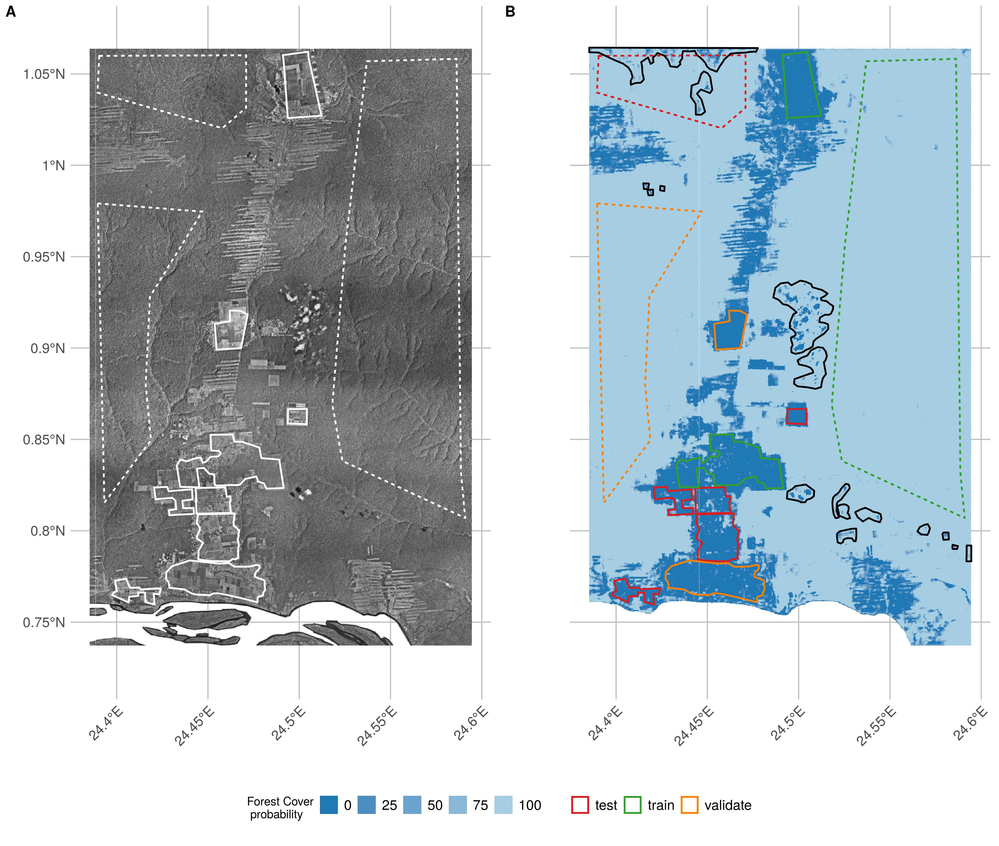

# Ortho DRC project

Please cite code, data and the manuscript as:

`Hufkens et al. 2020. Historical aerial surveys map long-term changes of
forest cover and structure in the central Congo Basin. Submitted.`

For full details on the methodology and results I refer to the above manuscript. To explore the data interactively I refer to the [the repository website](https://khufkens.github.io/orthodrc/).

## Historical aerial surveys map long-term changes of forest cover and structure in the central Congo Basin

Land Use and Land Cover change (LULCC) of African rainforest contribute to global carbon emissions. Yet, most historical estimates of LULCC and their carbon emissions rely on non-spatially explicity data in the pre-satellite era (< 1972).

Past studies have expanded this pre-satellite time frame with declassified satellite surveillance data or aerial surveys, but none cover the Congo Basin. Here, we use historical aerial survey photos to map the extent and structure of LULCC around Yangambi, central Congo Basin, in 1958. Our study leveraged Structure-from-Motion to generate a large orthomosaic covering 828 km^2^, counting 733 million pixels, at a sub meter resolution and geo-referenced to ~4.7 +- 4.3 m. 

Primary forest in the orthomosaic was classified with a Convolutional Neural Network Deep Learning approach. We used these data to quantify LULCC, landscape and canopy complexity and scale above ground biomass between historical and contemporary condition. We show a shift from historical highly structured industrial deforestation in 1958 (162 km^2^), to contemporary smallholder farming clearing (88 km^2^), increasing landscape fragmentation and forest edges. Efforts to quantify canopy texture and their link to carbon storage had limited to no success. 

Our analysis provides an insight in key spatial and temporal patterns of deforestation and reforestation at a multi-decadal scale and provide a historical context to land-cover and land-use change spatial patterns for past and ongoing field research in the area.

